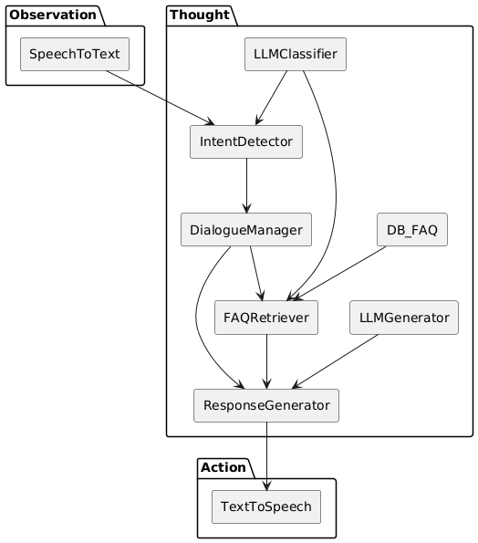

# 🎤🧠🔊 Graph-Driven Voice Agent with TAO Cycle

_A modular, fully local conversational AI system following the Thought-Action-Observation cycle._

[](https://www.python.org/downloads/)
[](LICENSE)
[](https://ollama.com/)
[](https://github.com/openai/whisper)
[](https://huggingface.co/)

---

**Graph-Driven Voice Agent** is a voice-controlled conversational agent that follows the **Thought-Action-Observation (TAO) Cycle**.  
It uses **local speech-to-text**, **intent detection**, **graph-based dialogue management**, **optional FAQ retrieval**, and **LLM-driven response generation** — all running **entirely offline**.

Designed to simulate realistic **phone call interactions** through **modular components**.

---

## 📂 Project Structure

```
graph_voice_agent/
├── main.py                  # Runs the full TAO cycle
├── observation/              # Captures and processes user speech
│   └── speech_to_text.py
├── thought/                  # Reasoning, planning, and decision-making
│   ├── intent_detector.py
│   ├── dialogue_manager.py
│   ├── faq_retriever.py
│   └── response_generator.py
├── action/                   # Acting back into the environment
│   └── text_to_speech.py
├── dialogue_graph/           # Dialogue and template definitions
│   ├── conversation_graph.json
│   ├── faq.json
│   └── templates.json
├── utils/
│   └── logger.py
├── imgs/                     # Project diagrams and images
│   └── uml.png
├── requirements.txt          # Project dependencies
├── LICENSE                   # Project license
└── README.md                 # Project documentation
```

---

## 🔥 Key Features

- **TAO Cycle**: Structured into Observation → Thought → Action phases.
- **Speech-to-Text**: Real-time voice transcription using OpenAI Whisper (locally).
- **Intent Detection**: Zero-shot classification with Hugging Face Transformers.
- **Graph-Based Dialogue Manager**: Control conversation flow via JSON graph.
- **FAQ Retrieval**: Optional, using zero-shot matching over a knowledge base.
- **Natural Language Generation**: Smart responses using Ollama and LLaMA 3 locally.
- **Text-to-Speech**: Voice output via pyttsx3 (offline).
- **Fully Offline Operation**: No paid APIs required.

---

## 🧩 Technologies Used

| Category | Technology |
|:---------|:------------|
| ASR (Speech Recognition) | [Whisper](https://github.com/openai/whisper) |
| NLU (Intent Detection) | [Transformers](https://huggingface.co/) |
| NLG (Response Generation) | [Ollama](https://ollama.com/) (LLaMA 3) |
| Graph Traversal | Custom JSON-based dialogue manager |
| TTS (Speech Output) | [pyttsx3](https://pyttsx3.readthedocs.io/en/latest/) |
| Programming Language | Python 3.10+ |

---

## 🚀 Getting Started

### 1. Install Dependencies

```bash
pip install -r requirements.txt
```

### 2. Set up Whisper

```bash
pip install openai-whisper
pip install sounddevice numpy scipy
```

### 3. Set up Transformers (Intent Detection)

```bash
pip install transformers
```

### 4. (Optional) Create Virtual Environment

```bash
python -m venv venv
source venv/bin/activate  # On Windows: .\venv\Scripts\activate
```

### 5. Set up Ollama (Local LLM Engine)

- Download and install Ollama from [official website](https://ollama.com/).
- Pull the LLaMA 3 model:
    ```bash
    ollama pull llama3
    ```
- Start the Ollama server:
    ```bash
    ollama serve
    ```

> Ollama API will run locally at `http://localhost:11434`. Keep it running during agent execution.

### 6. Run the Voice Agent

```bash
python main.py
```

✅ Speak when prompted, and the system will respond intelligently through speech.

---

## 🧠 TAO Cycle Architecture Diagram

The following diagram illustrates the full TAO architecture:



---

## 🌟 Future Improvements

- 🌐 Add a simple GUI (Streamlit / Gradio)
- 🧠 Dynamic dialogue graph updates
- 🗣️ Multi-language support (templates and FAQs)
- 🔍 Real-time external knowledge fetching
- 🧠 Fine-tuning lightweight local LLMs
- 💾 Session memory persistence

---

## 📖 References

   1. Yin, M., Roccabruna, G., Azad, A., & Riccardi, G. (2023). Let's Give a Voice to Conversational Agents in Virtual Reality. arXiv. [https://doi.org/10.48550/arXiv.2308.02665](https://doi.org/10.48550/arXiv.2308.02665)
   2. Wang, H., Kwan, W.-C., Li, M., Zhou, Z., & Wong, K.-F. (2024). KddRES: A Multi-level Knowledge-driven Dialogue Dataset for Restaurant Towards Customized Dialogue System. Computer Speech & Language, 87, 101637. [https://doi.org/10.1016/j.csl.2024.101637](https://doi.org/10.1016/j.csl.2024.101637)
   3. Hussain, S., Ameri Sianaki, O., Ababneh, N. (2019). A Survey on Conversational Agents/Chatbots Classification and Design Techniques. In: Barolli, L., Takizawa, M., Xhafa, F., Enokido, T. (eds) Web, Artificial Intelligence and Network Applications. WAINA 2019. Advances in Intelligent Systems and Computing, vol 927. Springer, Cham. [https://doi.org/10.1007/978-3-030-15035-8_93](https://doi.org/10.1007/978-3-030-15035-8_93)
   4. Fang, R., Bowman, D., & Kang, D. (2024). Voice-Enabled AI Agents can Perform Common Scams (arXiv:2410.15650). [https://arxiv.org/abs/2410.15650](https://arxiv.org/abs/2410.15650)
   5. Li, G., Al Kader Hammoud, H. A., Itani, H., Khizbullin, D., & Ghanem, B. (2023). CAMEL: communicative agents for "mind" exploration of large language model society. In Proceedings of the 37th International Conference on Neural Information Processing Systems (Article 2264, pp. 1–18). Curran Associates Inc.[https://arxiv.org/abs/2303.17760](https://arxiv.org/abs/2303.17760)

---

## 📬 Contact

If you have any questions or want to reach out to the team, please send me an email at [henrique382@gmail.com](henrique382@gmail.com).

## 📚 License

Distributed under the **MIT License**. See [LICENSE](LICENSE) for more information.

Developed by **Gabriel Henrique Alencar Medeiros**.

---
