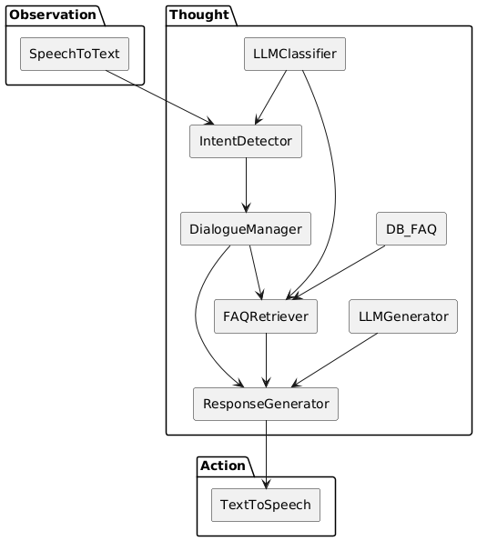

# 🎤🧠🔊 Graph-Driven Voice Agent with TAO Cycle

*A modular, fully local conversational AI system following the Thought-Action-Observation cycle.*

[](https://www.python.org/downloads/)
[](LICENSE)
[](https://ollama.com/)
[](https://github.com/openai/whisper)
[](https://huggingface.co/)

---

**Graph-Driven Voice Agent** is a voice-controlled conversational agent that follows the **Thought-Action-Observation (TAO) Cycle**.
It uses **real-time voice detection (VAD)**, **speech-to-text via Whisper**, **zero-shot intent classification**, **graph-based dialogue**, **optional knowledge retrieval**, and **LLM-driven generation** — all offline or via local models.

---

## 📂 Project Structure

```
graph_voice_agent/
├── main.py                     # Run the TAO loop
├── observation/                # Speech input (with VAD support)
│   └── speech_to_text.py
├── thought/                    # Reasoning and planning
│   ├── intent_detector.py
│   ├── dialogue_manager.py
│   ├── faq_retriever.py
│   └── response_generator.py
├── action/                     # Speaking responses
│   └── text_to_speech.py
├── dialogue_graph/             # Dialogue logic and templates
│   ├── conversation_graph.json
│   ├── faq.json
│   └── templates.json
├── services/                   # Encapsulated logic for LLM and DB
│   ├── db_faq.py
│   ├── llm_classifier.py
│   └── llm_generator/
│       ├── base.py
│       ├── api_base.py
│       ├── openrouter.py
│       └── ollama.py
├── utils/
│   ├── graph_utils.py
│   └── logger.py
├── imgs/                       # Architecture diagrams
│   └── uml.png
├── secrets/                    # API key (excluded from Git)
│   └── apikey.json
├── .gitignore
├── requirements.txt
└── README.md
```

---

## 🔥 Key Features

* ✅ **Real-Time VAD (Voice Activity Detection)** using `webrtcvad`
* 🗣️ **Multilingual ASR + English translation** via Whisper
* 🧠 **Intent Detection** via Hugging Face zero-shot models
* 🔀 **Graph-Based Dialogue** with modular transitions
* 📚 **FAQ Answering** per dialogue state
* 🧾 **Template + LLM Response Generation**
* 🔊 **Offline Text-to-Speech (pyttsx3)**
* 🔌 **Fully offline or API-based setups**

---

## 🧩 Technologies Used

| Category         | Technology                                                          |
| ---------------- | ------------------------------------------------------------------- |
| ASR (Speech)     | [Whisper](https://github.com/openai/whisper)                        |
| VAD              | [webrtcvad](https://github.com/wiseman/py-webrtcvad)                |
| Intent Detection | [Transformers](https://huggingface.co/)                             |
| Dialogue Manager | JSON-based state graphs                                             |
| LLM Generator    | [Ollama](https://ollama.com/), [OpenRouter](https://openrouter.ai/) |
| TTS              | [pyttsx3](https://pyttsx3.readthedocs.io/)                          |
| Language         | Python 3.10+                                                        |

---

## 🚀 Getting Started

### 1. Install Python packages

```bash
pip install -r requirements.txt
```

If `webrtcvad` fails to install on Windows, install Visual Studio Build Tools:
👉 [https://visualstudio.microsoft.com/visual-cpp-build-tools/](https://visualstudio.microsoft.com/visual-cpp-build-tools/)

### 2. Install Whisper + Audio dependencies

```bash
pip install openai-whisper sounddevice numpy scipy
```

### 3. (Optional) Create a virtual environment

```bash
python -m venv venv
source venv/bin/activate  # Windows: .\venv\Scripts\activate
```

### 4. Ollama Setup (Local LLMs)

* Install Ollama: [https://ollama.com/](https://ollama.com/)
* Pull a model:

  ```bash
  ollama pull llama3
  ```
* Start the server:

  ```bash
  ollama serve
  ```

### 5. (Optional) Use OpenRouter API

* Create a file at `secrets/apikey.json`:

```json
{
  "api_key": "your-openrouter-key"
}
```

* Run with:

```bash
python main.py --mode api
```

### 6. Run the Voice Agent

```bash
python main.py
```

Speak clearly when prompted. The system will listen, classify your intent, retrieve knowledge, and respond.

---

## 🧠 TAO Cycle Architecture



---

## ✅ Example Intents & States

* `greet → ask_information`
* `book_meeting → confirm_booking → end`
* `cancel → end`
* `ask_information → provide_information`

---

## 🌟 Coming Soon


* 📡 Knowledge-based (Ontology + KG) integration
* 🧠 Fine-tuned local intent models
* 💬 Session memory and logging
* 🌍 Full multilingual response support
* 🎛️ GUI (Streamlit or Gradio) ?

---

## 📖 References

   1. Yin, M., Roccabruna, G., Azad, A., & Riccardi, G. (2023). Let's Give a Voice to Conversational Agents in Virtual Reality. arXiv. [https://doi.org/10.48550/arXiv.2308.02665](https://doi.org/10.48550/arXiv.2308.02665)
   2. Wang, H., Kwan, W.-C., Li, M., Zhou, Z., & Wong, K.-F. (2024). KddRES: A Multi-level Knowledge-driven Dialogue Dataset for Restaurant Towards Customized Dialogue System. Computer Speech & Language, 87, 101637. [https://doi.org/10.1016/j.csl.2024.101637](https://doi.org/10.1016/j.csl.2024.101637)
   3. Hussain, S., Ameri Sianaki, O., Ababneh, N. (2019). A Survey on Conversational Agents/Chatbots Classification and Design Techniques. In: Barolli, L., Takizawa, M., Xhafa, F., Enokido, T. (eds) Web, Artificial Intelligence and Network Applications. WAINA 2019. Advances in Intelligent Systems and Computing, vol 927. Springer, Cham. [https://doi.org/10.1007/978-3-030-15035-8_93](https://doi.org/10.1007/978-3-030-15035-8_93)
   4. Fang, R., Bowman, D., & Kang, D. (2024). Voice-Enabled AI Agents can Perform Common Scams (arXiv:2410.15650). [https://arxiv.org/abs/2410.15650](https://arxiv.org/abs/2410.15650)
   5. Li, G., Al Kader Hammoud, H. A., Itani, H., Khizbullin, D., & Ghanem, B. (2023). CAMEL: communicative agents for "mind" exploration of large language model society. In Proceedings of the 37th International Conference on Neural Information Processing Systems (Article 2264, pp. 1–18). Curran Associates Inc.[https://arxiv.org/abs/2303.17760](https://arxiv.org/abs/2303.17760)

---

## 📬 Contact

If you have any questions or want to reach out to the team, please send me an email at [henrique382@gmail.com](henrique382@gmail.com).

## 📚 License

MIT License — see [LICENSE](LICENSE)

Developed by **Gabriel Henrique Alencar Medeiros**
