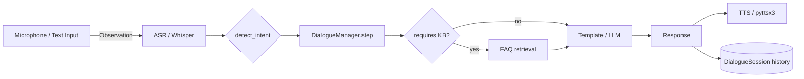

# 🎤🧠🔊 KGConvAI — Graph-Driven Voice Agent with TAO Cycle

[](https://github.com/Gabriel382/KGConversationalAI/actions/workflows/ci.yml)
[](https://github.com/Gabriel382/KGConversationalAI/actions/workflows/eval.yml)
[](https://github.com/Gabriel382/KGConversationalAI/actions/workflows/docs.yml)
[](https://www.python.org/downloads/)
[](LICENSE)
[](https://github.com/astral-sh/ruff)
[](https://mypy.readthedocs.io/)

> **A modular conversational AI agent that runs over a real knowledge graph, with a Thought–Action–Observation control loop.**
> Voice in, voice out, fully offline if you want it. Backed by RDF/OWL and Neo4j, with a Gradio chat demo and a Streamlit admin panel for editing the graph visually.

📖 **[Documentation](https://gabriel382.github.io/KGConversationalAI/)** &nbsp;·&nbsp; 🤗 **HF Space** *(coming soon — deploy from `huggingface/`)* &nbsp;·&nbsp; 🐛 **[Issues](https://github.com/Gabriel382/KGConversationalAI/issues)**

---

## Why this exists

Most chatbot side-projects collapse the whole stack — speech recognition, intent detection, dialogue policy, knowledge lookup, response generation — into a single `respond(text)` function. That's enough for a toy, but it hides every interesting engineering decision.

KGConvAI separates the four concerns of a real conversational system into independent, swappable modules:

1. **A finite-state machine** for "where am I in the conversation?"
2. **A knowledge graph** for "what do I know that I might need to look up?"
3. **A template / LLM dispatcher** for "what do I tell the user?"
4. **A typed session model** for "who am I talking to right now?"

Each one lives behind an interface, has its own tests, and can be swapped out — and the architecture is named, documented in [ADRs](https://gabriel382.github.io/KGConversationalAI/adr/), and exercised by a labelled evaluation harness that runs on every PR.

---

## Architecture


```mermaid
flowchart LR
    A[Microphone / Text Input] -->|Observation| B[ASR / Whisper]
    B --> C{detect_intent}
    C --> D[DialogueManager.step]
    D --> E{requires KB?}
    E -- yes --> F[FAQ retrieval]
    E -- no --> G[Template / LLM]
    F --> G
    G --> H[Response]
    H --> I[TTS / pyttsx3]
    H --> J[(DialogueSession history)]
```

The knowledge graph itself is **canonical JSON** in `dialogue_graph/kg.json`, validated against `schemas/kgconvai.schema.json`. From that single source, the same data is loaded into either an **rdflib** triple store (zero-install, used in CI) or a **Neo4j** property graph (production-grade, browsable). Round-trips are byte-identical and verified by tests.

```
JSON ⇄ rdflib (SPARQL)
     ⇄ Neo4j (Cypher)
```

---

## Installation

The package uses optional extras so you only install what you need.

```bash
# Library + template-mode CLI (no audio, no LLM)
pip install -e .

# Full development install (lint + types + tests + KG + Neo4j + web demo)
pip install -e ".[dev,web]"

# Voice mode (Whisper STT + pyttsx3 TTS + WebRTC VAD)
pip install -e ".[voice]"

# Embedding-based intent / FAQ retrieval (sentence-transformers, ~80 MB model)
pip install -e ".[embeddings]"

# Everything
pip install -e ".[dev,voice,nlu,embeddings,web,docs]"
```

| Extra         | Brings in                                  | When to use                                   |
|---------------|---------------------------------------------|-----------------------------------------------|
| `[voice]`     | Whisper, sounddevice, WebRTC VAD, pyttsx3   | Real voice conversations                      |
| `[nlu]`       | Transformers, torch                          | Zero-shot intent (BART-MNLI)                  |
| `[embeddings]`| sentence-transformers                        | Faster + smaller than zero-shot               |
| `[kg]`        | rdflib, jsonschema                           | Standalone KG tooling                         |
| `[neo4j]`     | Neo4j Python driver                          | Neo4j backend / graph visualisation           |
| `[web]`       | Gradio, Streamlit, PyVis                     | Chat UI + admin panel                         |
| `[docs]`      | MkDocs Material                              | Local docs preview                            |
| `[dev]`       | All of the above + pytest, ruff, mypy        | Contributing                                  |

### Docker

```bash
docker compose -f docker/docker-compose.yml up -d
# chat UI    -> http://localhost:7860
# admin      -> http://localhost:8501
# Neo4j      -> http://localhost:7474   (neo4j / kgconvai)
```

---

## Quickstart

### Talk to the agent in the browser

```bash
# Template mode (no LLM, deterministic, zero setup)
python -m kgconvai web chat

# Local LLM via Ollama
ollama pull llama3            # one-time
python -m kgconvai web chat --mode local

# Hosted LLM via OpenRouter
export KGCONVAI_OPENROUTER_API_KEY=sk-or-v1-...
python -m kgconvai web chat --mode api
```

Opens at `http://localhost:7860`. Each browser tab keeps its own `DialogueSession`, so multiple visitors hold independent conversations on the same server.

### Edit the knowledge graph visually

```bash
python -m kgconvai web admin
```

Opens at `http://localhost:8501`. You get tabs for every section of `kg.json`, a PyVis-rendered visualisation of the dialogue graph (blue = regular state, green = requires-knowledge, red = terminal), and validate-before-save so invalid edits never reach disk.

### Or use it as a library

```python
from kgconvai import Agent, DialogueSession, Settings
from kgconvai.asr.whisper import WhisperASR
from kgconvai.dialogue.graph import DialogueGraph
from kgconvai.dialogue.templates import TemplateStore
from kgconvai.llm.ollama import OllamaLLM
from kgconvai.nlu.classifier import ZeroShotClassifier
from kgconvai.nlu.faq import FAQStore
from kgconvai.tts.pyttsx3_engine import Pyttsx3TTS

agent = Agent(
    asr=WhisperASR("base"),
    tts=Pyttsx3TTS(),
    classifier=ZeroShotClassifier(),
    graph=DialogueGraph.from_path("dialogue_graph/kg.json"),
    faq=FAQStore.from_path("dialogue_graph/kg.json"),
    templates=TemplateStore.from_path("dialogue_graph/kg.json"),
    llm=OllamaLLM(),
    settings=Settings(),
)

# Voice loop
agent.run()

# Or programmatic single-turn
reply = agent.respond("I'd like to book a meeting")
```

---

## CLI reference

```bash
kgconvai version                  # 0.5.0
kgconvai info                     # show resolved settings
kgconvai validate                 # check that data files load

# Voice agent
kgconvai run --mode local         # full TAO loop with microphone

# Web interfaces
kgconvai web chat   [--mode local|api|template] [--port 7860]
kgconvai web admin  [--data dialogue_graph/kg.json]

# Knowledge graph tooling
kgconvai kg validate <path>                        # validate against the canonical schema
kgconvai kg export   --backend rdf|neo4j --from <json> --to <json>
kgconvai kg diff     <a.json> <b.json>             # canonicalised diff

# Evaluation
kgconvai eval intents [--classifier substring|embedding|zero_shot] [--threshold N] [--json-out path]
kgconvai eval faq     [--classifier substring|embedding|zero_shot] [--threshold N] [--json-out path]
```

All subcommands support `--help`.

---

## Knowledge graph

`dialogue_graph/kg.json` is the **single source of truth**. It validates against `schemas/kgconvai.schema.json` on every load:

```json
{
  "version": "1.0",
  "states":      [ { "id": "start" } ],
  "intents":     [ { "id": "greet" } ],
  "transitions": [ { "from": "start", "intent": "greet", "to": "ask_information" } ],
  "faqs":        [ { "id": "...", "intent": "...", "question": "...", "answer": "..." } ],
  "templates":   [ { "intent": "...", "text": "..." } ]
}
```

The same data round-trips losslessly through two backends:

### rdflib (zero-install)

```bash
kgconvai kg export --backend rdf --from dialogue_graph/kg.json --to /tmp/rt.json
kgconvai kg diff dialogue_graph/kg.json /tmp/rt.json
# → identical
```

```python
from kgconvai.kg.rdf_backend import RDFBackend
graph = RDFBackend(ontology_paths=["ontology/core.ttl"]).import_(data)
rows = graph.query("""
  PREFIX kgc: <http://kgconvai.org/core#>
  SELECT ?from ?intent ?to WHERE {
    ?t a kgc:Transition ;
       kgc:hasFromState ?from ;
       kgc:triggersIntent ?intent ;
       kgc:hasToState ?to .
  }
""")
```

### Neo4j (Docker)

```bash
docker compose -f docker/docker-compose.yml up -d neo4j
kgconvai kg export --backend neo4j --from dialogue_graph/kg.json --to /tmp/rt.json
```

Browse the imported graph at `http://localhost:7474` and run:

```cypher
MATCH (a:State)-[r:TRANSITIONS]->(b:State) RETURN a, r, b
```

### Ontology

`ontology/core.ttl` defines the generic vocabulary (`DialogueState`, `Intent`, `Transition`, `FAQEntry`, `ResponseTemplate`). `ontology/examples/phone_call.ttl` extends it with a domain example (`Caller`, `Service`, `Appointment`, `BusinessHours`).

---

## Evaluation

Hand-labelled gold datasets live in `eval/`:

- `eval/intents.yaml` — 44 utterances across 7 intent classes.
- `eval/faq.yaml` — 18 paraphrased questions over 9 FAQ entries.

The harness reports **accuracy / P@1**, **P@3**, **MRR**, and **latency p50/p95/mean**:

```bash
# Quick baseline (substring matcher — deliberately dumb)
python -m kgconvai eval intents --classifier substring

# Sentence-transformer embeddings (recommended)
python -m kgconvai eval intents --classifier embedding

# Zero-shot NLI (BART-MNLI, slowest)
python -m kgconvai eval intents --classifier zero_shot
```

Sample run:

```
intents eval — embedding(MiniLM-L6-v2)
N                                  44
Accuracy / P@1                     ~90%
P@3                                ~100%
MRR                                ~0.94
Latency p50 / p95 / mean (ms)      ~12 / ~25 / ~14
```

`.github/workflows/eval.yml` runs the eval on every PR, posts a comment with the metrics table, and **fails the build if accuracy drops below threshold**.

---

## Development

```bash
pip install -e ".[dev,web,docs]"
pre-commit install

# Same pipeline CI runs:
ruff check src tests
ruff format --check src tests
mypy
pytest --cov

# Only fast unit tests
pytest -m "not integration and not neo4j"

# Build the docs locally
mkdocs serve   # http://localhost:8000
```

CI runs the full pipeline on Python 3.10, 3.11, and 3.12 (`.github/workflows/ci.yml`).

### Project layout

```
src/kgconvai/
├── agent.py              # high-level Agent — drives the TAO cycle
├── cli.py                # typer CLI: run / info / validate / version / kg / web / eval
├── config.py             # Settings (pydantic-settings, env-driven)
├── logging.py            # structlog setup (console / JSON)
├── state.py              # DialogueSession, Turn, Speaker
├── asr/                  # speech-to-text (Whisper + WebRTC VAD)
├── tts/                  # text-to-speech (pyttsx3)
├── llm/                  # LLMGenerator + Ollama + OpenRouter
├── nlu/                  # classifier protocol + intent + FAQ retrieval
├── dialogue/             # DialogueGraph + DialogueManager + TemplateStore
├── kg/                   # KGData + KnowledgeGraph ABCs + rdflib + Neo4j backends
├── web/                  # Gradio chat + Streamlit admin
└── eval/                 # datasets + metrics + runners

dialogue_graph/kg.json    # canonical knowledge graph (validated by schema)
schemas/                  # JSON Schema for the canonical format
ontology/                 # OWL/Turtle vocabularies (core + phone-call example)
eval/                     # labelled test sets
docs/                     # MkDocs site (deployed to GitHub Pages)
docker/                   # Dockerfile + docker-compose for the full stack
huggingface/              # Hugging Face Space scaffolding
tests/                    # ~80 unit + integration tests
```

---

## Configuration

All runtime configuration is environment-driven via `KGCONVAI_*` variables (read by `kgconvai.config.Settings`):

```bash
KGCONVAI_LLM_MODE=template               # local | api | template
KGCONVAI_OLLAMA_MODEL=llama3
KGCONVAI_OLLAMA_URL=http://localhost:11434/api/generate
KGCONVAI_OPENROUTER_API_KEY=sk-or-v1-... # only if mode=api
KGCONVAI_OPENROUTER_MODEL=deepseek/deepseek-v3-base:free
KGCONVAI_WHISPER_MODEL=base
KGCONVAI_VAD_AGGRESSIVENESS=2
KGCONVAI_FAQ_CONFIDENCE_THRESHOLD=0.4
```

Copy `.env.example` to `.env` for local development; `.env` is git-ignored.

---

## Status & roadmap

| Version | Theme                                                         |
|---------|---------------------------------------------------------------|
| 0.2.0 ✅ | Professionalization: src layout, tests, CI, structlog, pre-commit |
| 0.3.0 ✅ | Canonical schema + OWL ontology + rdflib + Neo4j + embeddings |
| 0.4.0 ✅ | Gradio chat + Streamlit admin + Dockerfile + HF Space scaffold |
| 0.5.0 ✅ | Labelled eval harness in CI + MkDocs docs site                |
| 0.6.0 — | Live HF Space deploy + demo GIF + intent-classifier fine-tune |

Architecture decisions are documented as [ADRs](https://gabriel382.github.io/KGConversationalAI/adr/) in the docs site.

---

## References

1. Yin, M., Roccabruna, G., Azad, A., & Riccardi, G. (2023). *Let's Give a Voice to Conversational Agents in Virtual Reality*. arXiv:2308.02665.
2. Wang, H., Kwan, W.-C., Li, M., Zhou, Z., & Wong, K.-F. (2024). *KddRES: A Multi-level Knowledge-driven Dialogue Dataset for Restaurant*. Computer Speech & Language, 87.
3. Hussain, S., Ameri Sianaki, O., Ababneh, N. (2019). *A Survey on Conversational Agents/Chatbots Classification and Design Techniques*. WAINA 2019.
4. Fang, R., Bowman, D., & Kang, D. (2024). *Voice-Enabled AI Agents can Perform Common Scams*. arXiv:2410.15650.
5. Li, G., et al. (2023). *CAMEL: communicative agents for "mind" exploration of large language model society*. NeurIPS 2023.

---

## License & author

MIT — see [LICENSE](LICENSE).

Built by **Gabriel Henrique Alencar Medeiros** ([henrique382@gmail.com](mailto:henrique382@gmail.com)).
Contributions welcome — open an issue or PR.
