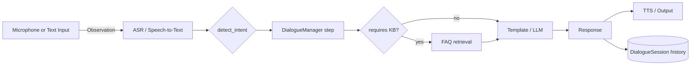

# Architecture

The agent runs a Thought-Action-Observation cycle over a per-session
`DialogueSession`.

## Module map

| Package                       | Role                                                       |
|-------------------------------|-----------------------------------------------------------|
| `kgconvai.agent`              | Orchestrates the TAO cycle.                                |
| `kgconvai.state`              | `DialogueSession`, `Turn`, `Speaker`.                      |
| `kgconvai.asr`                | Whisper STT (+ WebRTC VAD).                                |
| `kgconvai.tts`                | pyttsx3 TTS.                                               |
| `kgconvai.llm`                | Abstract `LLMGenerator` + Ollama + OpenRouter clients.     |
| `kgconvai.nlu`                | Zero-shot + embedding classifiers; intent + FAQ retrieval. |
| `kgconvai.dialogue`           | `DialogueGraph` + `DialogueManager` + `TemplateStore`.     |
| `kgconvai.kg`                 | `KGData` + ontology + rdflib & Neo4j backends.             |
| `kgconvai.web`                | Gradio chat + Streamlit admin.                             |
| `kgconvai.eval`               | Datasets + metrics + runner.                               |
| `kgconvai.cli`                | Typer-based command-line entry point.                      |
| `kgconvai.config`             | `Settings` (pydantic-settings).                            |
| `kgconvai.logging`            | structlog setup.                                           |

## Why TAO?

Most chatbots collapse the cycle into a single `respond(text)` function and
hide the state. TAO makes the three phases explicit:

- **Observation** has clear inputs (audio bytes, raw text) and a clean
  boundary (an `ASR` returning a `SpeechResult`).
- **Thought** is the only place that mutates `DialogueSession.current_state`
  and consults the knowledge graph.
- **Action** is purely side-effects (TTS, GUI update). Easy to mock in tests.

That separation is what lets us run the same agent in three places — voice,
Gradio, programmatic API — with no copy-paste.
