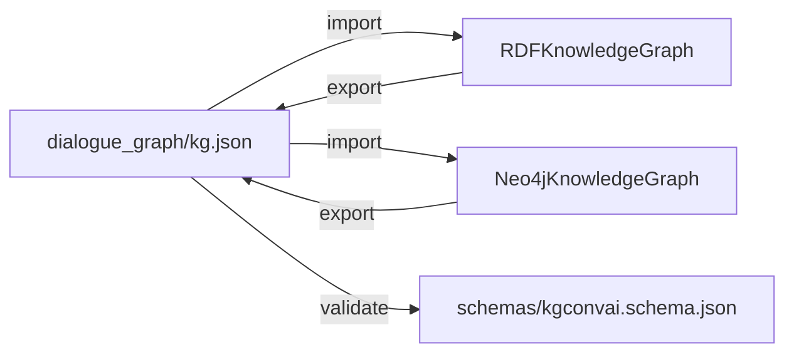

# Knowledge graph: overview

The KG layer is structured so the **JSON files in `dialogue_graph/` are the
source of truth**, and the runtime backends (rdflib in-process, Neo4j on
docker) are views derived from them.

You get:

- **Authorship** in plain JSON, diff-friendly in git, reviewable in PRs.
- **Exploration** in a real graph DB when you want it — Neo4j Browser is a
  free graph editor with syntax-highlighted Cypher.
- **Round-trip safety** by construction: the same export → import → export
  produces byte-identical JSON. There's a property test that enforces it.

## When do you switch backends?

- **rdflib** — testing, CI, embedded deployments, simple SPARQL needs.
- **Neo4j** — visualising large graphs, hands-on editing in the browser,
  multi-user write workloads, integrating with anything else that already
  speaks Cypher.
